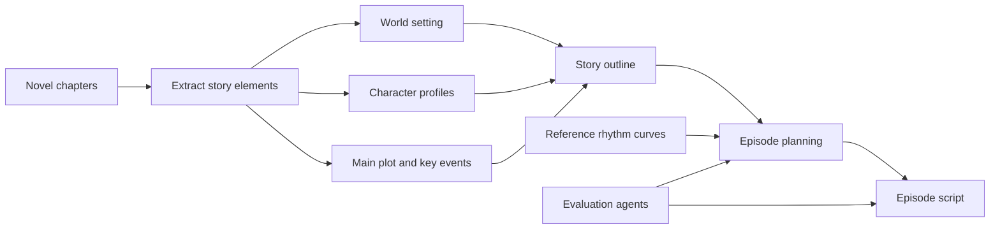

# Manhua Script Generation

> A sanitized project note on building a structured workflow for adapting web novels into manhua scripts.

## Background

The growth of manhua content and improvements in image, video, and multimodal generation have increased the demand for script production. The script is an upstream artifact: its pacing, character consistency, key plot points, and visual instructions directly affect downstream production quality.

Traditional novel-to-script adaptation depends heavily on manual experience. It is difficult to preserve long-form story information consistently while controlling episode rhythm, hooks, reversals, emotional beats, and production format.

## Objective

Build a standardized, automated, and structured capability for adapting web novels into production-ready episode scripts. The workflow is designed to support offline production review first, with online generation as a later direction after quality and compliance are validated.

## Workflow

## Core Design

- **Structured extraction:** preserve world settings, character relationships, main plot, hooks, reversals, and emotional beats before generation.
- **Hierarchical planning:** move from story outline to episode-level plot, hook, emotional anchor, and paywall point, then generate the script body.
- **Rhythm control:** use reference script rhythm curves and agent-based checks to identify pacing deviations before script delivery.
- **Format constraints:** keep episode, scene, time, location, character, action, dialogue, subtitle, voice-over, flashback, and camera cues in a consistent production format.
- **Quality evaluation:** combine expert review, product-side rubric scoring, and model-based checks for source adherence, narrative consistency, pacing, and script usability.

## Evaluation Dimensions

1. Source adherence: world setting, character identity, main plot, and key highlights.
2. Narrative quality: causal continuity, character motivation, emotional progression, and state consistency.
3. Episode rhythm: opening hook, scene-level pacing, reversals, emotional beats, and ending hook.
4. Production readiness: scene format, visualizability, dialogue attribution, subtitles, and camera instructions.

## Scope

This repository contains an abstracted workflow and evaluation design only. It does not include proprietary source novels, business scripts, internal prompts, model endpoints, training data, or company-internal documents.
